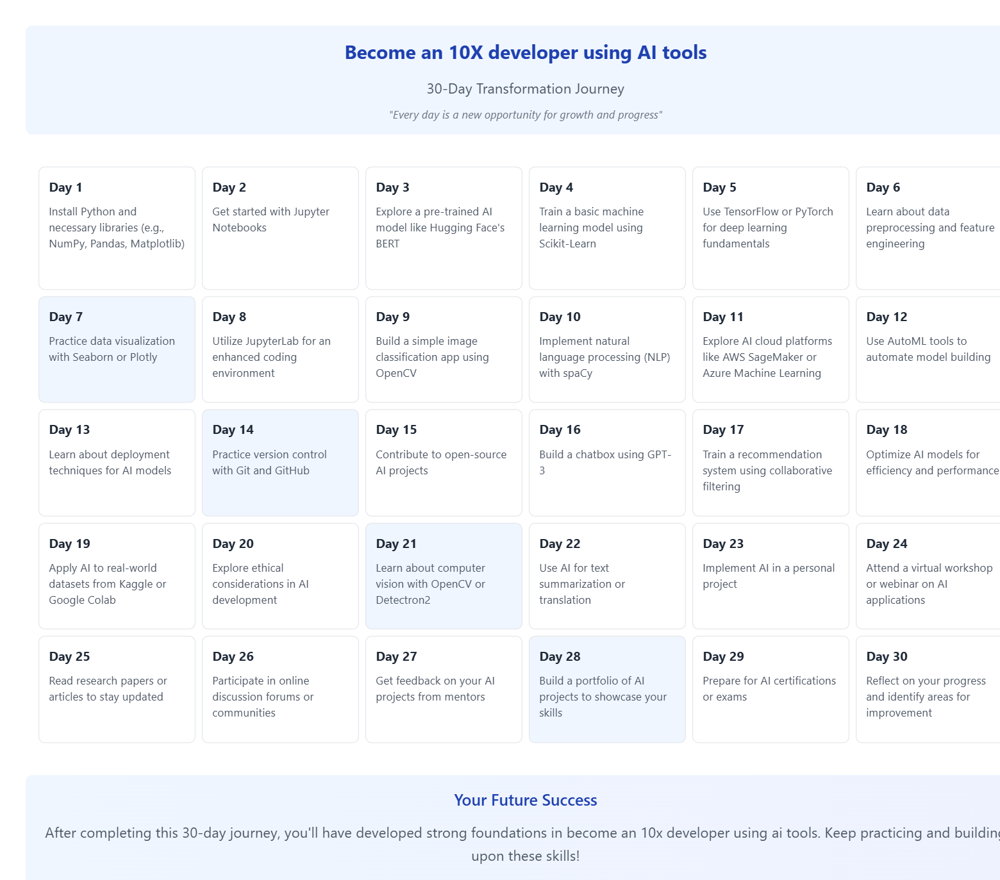

# Transform Journey

Transform Journey is a powerful web application that helps users create personalized transformation plans and learning journeys with AI-powered content generation and visual storytelling capabilities.



## 🌟 Features

- **AI-Powered Content Generation**: Leverages Google's Gemini Pro AI to create customized transformation plans
- **Interactive Rich Text Editor**: Full-featured editor with support for:
  - Text formatting (bold, italic)
  - Lists (bulleted and numbered)
  - Text alignment
  - Images and links
  - Flowcharts (using Mermaid.js)
  - Color customization
- **30-Day Calendar View**: Visual representation of your journey with daily tasks and goals
- **Multiple Transformation Types**:
  - Personal Growth
  - Career Development
  - Health & Wellness
  - Learning Journey
  - Creative Evolution
- **Export Capabilities**: Download your journey and calendar as high-quality PNG images

## 🚀 Getting Started

### Prerequisites

- Node.js (v16 or higher)
- npm or yarn
- Google AI API key

### Installation

1. Clone the repository:
```bash
git clone https://github.com/Bupalchow/Tranformation-helper.git
cd Tranformation-helper
```

2. Install dependencies:
```bash
npm install
# or
yarn install
```

3. Set up environment variables:
```bash
cp .env.example .env
```
Edit `.env` and add your Google AI API key:
```
VITE_GOOGLE_API_KEY=your_google_api_key_here
```

4. Start the development server:
```bash
npm run dev
# or
yarn dev
```

## 🎯 Usage

1. Select a transformation type from the dropdown menu
2. Enter your desired transformation topic
3. Click "Create Journey" to generate personalized content
4. Use the rich text editor to customize your journey
5. View and interact with the 30-day calendar
6. Download your journey and calendar as images

## 🛠️ Technologies Used

- React
- TypeScript
- Vite
- TailwindCSS
- Tiptap Editor
- Google Generative AI (Gemini Pro)
- Mermaid.js
- html-to-image
- Lucide React Icons


## 🤝 Contributing

Contributions are welcome! Please feel free to submit a Pull Request.

1. Fork the Project
2. Create your Feature Branch (`git checkout -b feature/AmazingFeature`)
3. Commit your Changes (`git commit -m 'Add some AmazingFeature'`)
4. Push to the Branch (`git push origin feature/AmazingFeature`)
5. Open a Pull Request
